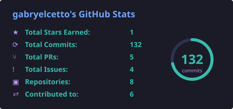
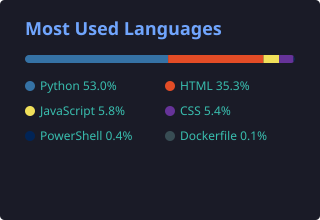

**Suporte/Desenvolvimento Jr. | Estudante de Análise e Desenvolvimento de Sistemas**

Sou estudante de Análise e Desenvolvimento de Sistemas, atualmente no 3º período, e já tenho experiência prática trabalhando com tecnologia no dia a dia. Além dos estudos, atuo com suporte e desenvolvimento, criando automações, trabalhando com sistemas e bancos de dados e desenvolvendo projetos reais em Python e desenvolvimento web.

## Socials

## 🛠️ Tech Stack

### Linguagens & Frameworks

### Bancos de Dados

### Ferramentas

### DevOps & CI/CD

### Metodologias

## 📊 GitHub Stats

  
  

